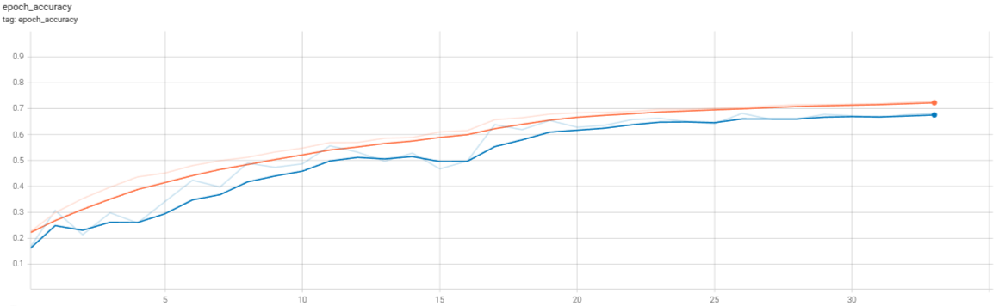

# Classificateur d'animaux par deep learning

Ce module d'université a pour but de découvrir l'IA par la pratique. J'ai choisi d'implémenter un classificateur d'animaux en m'appuyant sur le _dataset_ [Animals-10](https://www.kaggle.com/alessiocorrado99/animals10) disponible sur Kaggle.
Il contient 10 classes d'animaux: papillon, chat, poulet, vache, chien, éléphant, cheval, mouton, araignée et écureuil.

Le détail de l'implémentation et les résultats sont disponibles dans le fichier [animal_recognition.ipynb](animal_recognition.ipynb).

Au final, j'ai obtenu une précision de 0.68 sur les données de tests.

Voici les graphiques de précision et de perte obtenus lors de l'entraînement:

# Environnement de développement

Il vous faut l'archive du _dataset_ [Animals-10](https://www.kaggle.com/alessiocorrado99/animals10) pour exécuter le notebook. Vous pouvez décompresser l'archive dans le dossier `animal10` ou laisser le notebook le décompresser pour vous.

Il faut également installer les dépendances suivantes:

-   `numpy`
-   `matplotlib`
-   `tensorflow`
-   `pandas`

Ce dépôt utilise [Git LFS](https://git-lfs.github.com/) pour stocker le modèle obtenu (fichier `best.keras`). Assurez-vous de l'avoir configuré sur votre machine.

# Utilisation

Par défaut, le notebook charge le modèle déjà entraîné (fichier `best.keras`). Si vous souhaitez entraîner le modèle vous-même, un dictionnaire d'options est disponible dans la première cellule du notebook.

Pour décomprésser l'archive du _dataset_ dans le dossier `animal10`, remplacez la valeur de `"UNZIP"` par `True`. Par défaut, le notebook décompresse l'archive `animal-10.zip` du dossier courant.
